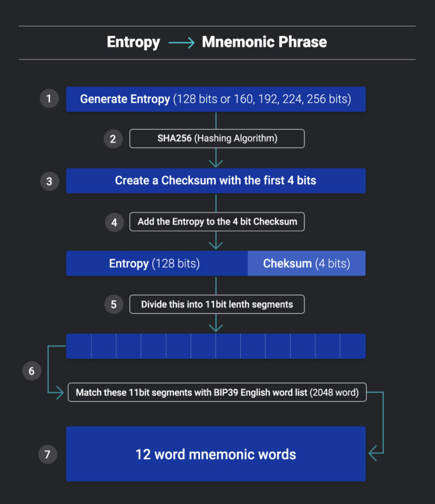
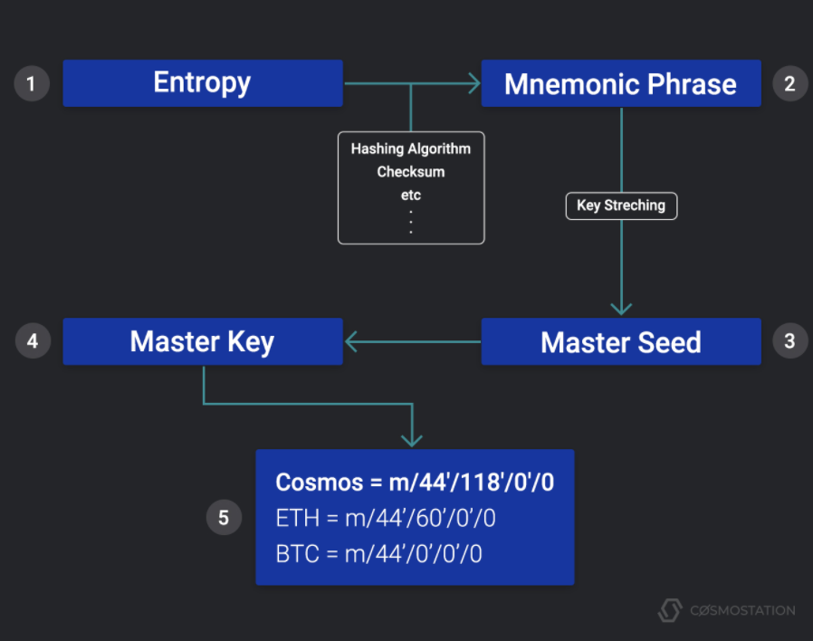

> BIP 全称是 Bitcoin Improvement Proposals，相当于互联网中RFC (Request for Comments)，它是用来记录草案或者标准的。

- BIP32解释

> 定义:BIP32定义了Hierarchical deterministic wallets (HD Wallets)，HD指出了这类钱包的两大特征。

> 第一点特征是层级结构，钱包一般会存储一组key-pair对，这组key-pair对是链状存储，但是HD钱包是树状存储，也就是说它的结构中有根节点，根节点会派生出子节点，子节点又可以派生出子节点。这样做的优势是它可以有选择的把某个层级的一组key-pair对分配出去，这样就可以和组织结构匹配，比如：总部保留根密钥，其它分部用总部派生的密钥；也可以和用途匹配，比如：花钱的和收钱的地址可以分开。

> 第二点特征是确定性，因为所有的key-pair对都是从同一个根派生出来的，所以只要妥善保管好根（主密钥）就可以在其它的系统中快速地恢复钱包。

 

- 生成助记词 



```
func test_mnemonic() {
	// Entropy 生成

	b, err := bip39.NewEntropy(128)
	if err != nil {
		log.Panic("failed to NewEntropy", err, b)
	}
	fmt.Println(b)

	// 生成助记词
	nm, err := bip39.NewMnemonic(b)
	if err != nil {
		log.Panic("failed to NewMnemonic ", err)
	}
	fmt.Println(nm)
}
```

- 从助记词生成地址,根据路径不同,生成币以及不同的地址




```
// 测试助记词有效
func test_ganache() {
	// 助记词转化为种子
	f, err := os.OpenFile(".secret", os.O_RDONLY, 0600)
	defer f.Close()
	if err != nil {
		fmt.Println(err.Error())
	}
	contentByte, err := ioutil.ReadAll(f)

	nm := string(contentByte)
	// 种子转化为账户地址
	//推导路径  再获取钱包
	path := MustParseDerivationPath("m/44'/60'/0'/0/0")

	wallet, err := NewFromMnemonic(nm, "")
	if err != nil {
		log.Panic("faile to NewFromMnemonic", err)
	}
	account, err := wallet.Derive(path, false)
	if err != nil {
		log.Panic("faile to Derive", err)
	}

	fmt.Println(account.Address.Hex())
    // 也可以修改路径 
	path = MustParseDerivationPath("m/44'/60'/0'/0/1")

	account, err = wallet.Derive(path, false)
	if err != nil {
		log.Panic("faile to Derive", err)
	}

	fmt.Println(account.Address.Hex())

}

```

- 私钥如何保存 

